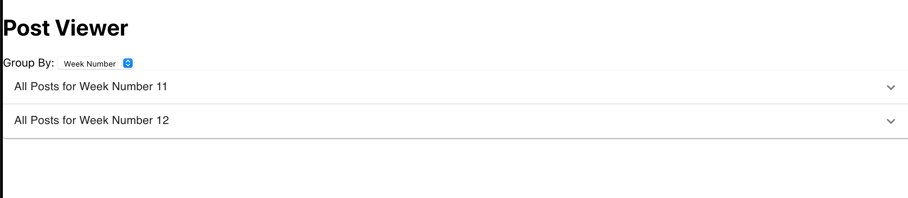
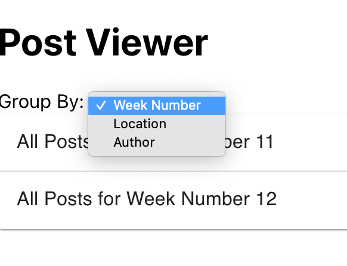
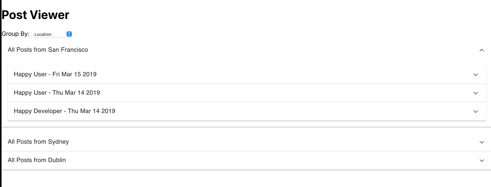
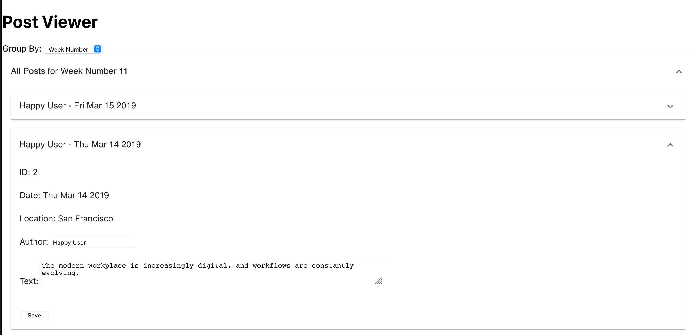
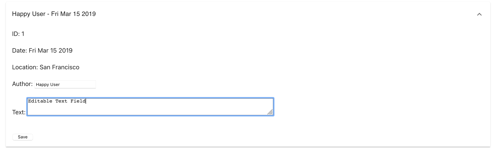

# React WebApp

This application is written in `Typescript`. The backend is a `NodeJS` `express` webserver. The frontend is a `React` webapp and uses `material-ui` components. The frontend was bootstrapped using `Create-React-App`.

It was tested with the following versions:
- `Node` v15.9
- `Typescript` v4.3.2
- `Yarn` v1.22.10
- `Jest` v26.6.3
- `OS` MacOS v11.2.1
- `Browser` Firefox v85.0.2 & Chrome v89.0.4389.82

## How to build this project

The client and server components must be built separately.
The front-end code and configuration can be found in `<project_root>/client`. Back-end files are found in `<project_root>/server`.

### Pre-requisites

- `Node`
- `Yarn`

### Server

- `cd server/`
- `yarn install`
- `yarn build`
- `yarn start`

This will start the backend server at `http://localhost:3001`.
### Client

- `cd client/`
- `yarn install`
- `yarn build`
- `yarn start`

This will start the client at `http://localhost:3000`.

## Testing and Code Coverage

### Server

Unit tests are written in typescript and executed with `Jest`.

To run unit tests for the backend, from the root directory, run:

`cd server && yarn test`

For code coverage, run:

`cd server && yarn coverage`

### Client


Unit tests are written in typescript and executed with `Jest`.

To run unit tests for the backend, from the root directory, run:

`cd client && yarn test`

This will start tests in watch mode. 
*NOTE* As test config was set up by `Create React App`, it is important to run yarn *test* and not yarn *jest*.

---

## Server

http://localhost:3001

A Postman collection is provided in `<project_root>/resources/REST Server.postman_collection.json`.

The server is a `NodeJS` application, written in `Typescript` and using `express`. It stores posts in a text file, and exposes them via the following REST endpoints:

### `GET /posts/`

Returns a HTTP 200 and a list of all posts.

Sample response: 
```
[
    {
        "id": 1,
        "location": "San Francisco",
        "time": "1615760863",
        "author": "Happy User",
        "text": "This is some updated text!"
    },
    {
        "id": 2,
        "location": "San Francisco",
        "time": "1615741376",
        "author": "Emma Lynch",
        "text": "The modern workplace is increasingly digital, and workflows are constantly evolving. "
    }
]
```

### `GET /posts/:id`

Returns a HTTP 200 with the post matching the id provided. If a post cannot be found with that id, a HTTP 404 is returned.

Sample Response:
```
 {
        "id": 1,
        "location": "San Francisco",
        "time": "1615760863",
        "author": "Happy User",
        "text": "This is some updated text!"
}
```

### `POST /posts/`

This will create a new post with the given data. The id and time fields will be automatically populated by the server. The location, author and text fields are optional, but the request body cannot be empty. On successful creation of a resource, the server responds with a HTTP 201 and a response body containing the new resource.

Sample request body:
```
{
    "author": "E Lynch",
    "text": "This is an updated post!"
}
```

Sample response: 
```
{
    "id": 24,
    "location": "Dublin",
    "time": "1615762691",
    "author": "Emma Lynch",
    "text": "This is a new post!"
}
```

### `PUT /posts/:id`

This endpoint will update the resource with the data provided. If a post does not exist with the provided id, a HTTP 404 will be returned. The location, author and text fields are optional, but the request body cannot be empty. On a successful update of a resource, the server responds with a HTTP 200 and a response body containing the updated resource.

Sample request body:
```
http://localhost:3001/posts/24
{
    "author": "E Lynch",
    "text": "This is an updated post!"
}
```

Sample response: 
```
{
    "id": 24,
    "location": "Dublin",
    "time": "1615762691",
    "author": "E Lynch",
    "text": "This is an updated post!"
}
```

--- 

## Client

The client consists of a `React` webapp with `material-ui` components. It is written in `Typescript`.

By default, posts are presented in collapsed panels, grouped by week number.


Posts can be re-grouped by selecting an option from the drop-down menu.




Clicking on a post opens a panel with more details.


Both the `Text` and the `Author` fields are editable. Changes made to these fields will be persisted to the server when the `Save` button is clicked. This will also cause re-ordering to occur, if necessary.


